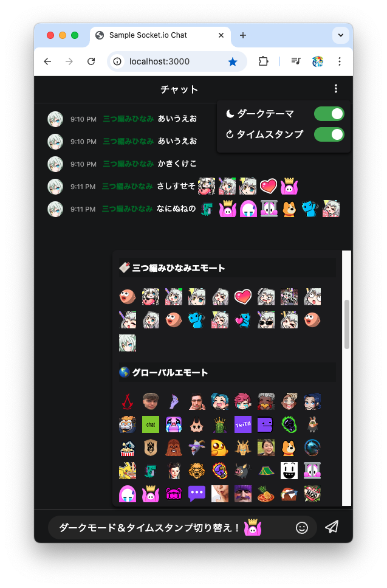
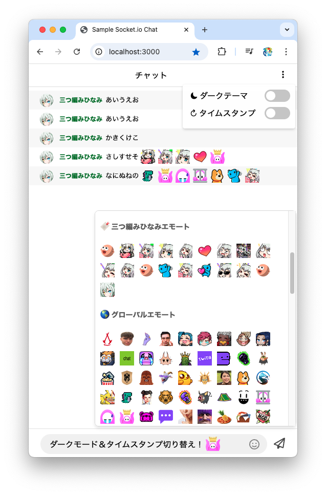

# Realtime Chat App - Twitch Sample

This is a real-time chat application built with Node.js, Express, and Socket.io.  
It integrates with the Twitch API to fetch user profile images, display names, and emotes dynamically.

🚀 Features:
- Twitch authentication support
- Displays Twitch user profile images and display names
- Supports Twitch emotes (both user-specific and global)
- Real-time chat with WebSockets (Socket.io)
- **Dark mode & timestamp toggle support**
- **Settings are saved using localStorage for persistence**
- Uses `csurf` and `cookie-parser` for CSRF protection (token generation and verification).
- Implements input sanitization & validation using `express-validator`.
- Loads Twitch `CLIENT_ID` and `CLIENT_SECRET` from environment variables using `dotenv`.

---

## 概要 (Japanese)

このアプリは、Node.js + Express + Socket.io で構築されたリアルタイムチャットのサンプルです。  
Twitch API を利用し、ユーザーのアイコン・表示名・エモートを取得して表示します。  
また、ダークテーマとタイムスタンプの表示切り替えに対応し、設定はローカルストレージに保存されます。

🚀 機能：
- Twitch 認証サポート
- Twitch ユーザー プロフィール画像と表示名を表示します
- Twitch エモート (ユーザー固有とグローバルの両方) をサポートします
- WebSocket (Socket.io) を使用したリアルタイム チャット
- ダークテーマとタイムスタンプの切り替えをサポート
- 設定は、永続性のために localStorage を使用して保存されます
- CSRF 保護 (トークンの生成と検証) には、`csurf` と `cookie-parser` を使用します。
- `express-validator` を使用して、入力のサニタイズと検証を実装します。
- `dotenv` を使用して、環境変数から Twitch `CLIENT_ID` と `CLIENT_SECRET` を読み込みます。

## Screenshot

**ダークテーマ/タイムスタンプ オン**


**ライトテーマ/タイムスタンプ オフ**


## 📌 必要な環境

- **Node.js** (推奨バージョン: `18.x.x` 以上)
- **npm** (`Node.js` に含まれています)

## 🔖 Twitch API を使う準備

- **[Twitch Developers](https://dev.twitch.tv/)** に アクセスし、**アプリケーション登録済み**である必要があります。
- 設定のOAuthのリダイレクトURL先は、
1. 開発環境の場合は `http://localhost:3000/auth/twitch/callback`
2. 本番環境の場合は `https://yourdomain/auth/twitch/callback` 、に設定してください。
- アプリケーション登録時に表示される **TWITCH_CLIENT_ID** と **TWITCH_CLIENT_SECRET** をメモしてください。

## 📥 インストール

### 1️⃣ このリポジトリをクローン
```sh
git clone https://github.com/tetchan-lab/sample-twitch-chat.git
cd sample-twitch-chat
```
### 2️⃣ 依存パッケージをインストール
```sh
npm install
```
### 3️⃣ .env「環境変数の設定を確認」
- プロジェクトルートに `.env` を作成し、以下のように記述してください。
- **Twitch 開発者ダッシュボード**（[こちら](https://dev.twitch.tv/console/apps)）でアプリケーションを作成し、表示される **TWITCH_CLIENT_ID** と **TWITCH_CLIENT_SECRET** を以下のように設定します。
```sh
TWITCH_CLIENT_ID=yourclientid
TWITCH_CLIENT_SECRET=yourclientsecret
```
### 4️⃣ アプリを起動
```sh
npm start
```
または  
```sh
node index.js
```
### 5️⃣ 動作確認
- ブラウザで http://localhost:3000 にアクセスし、チャットが正常に動作していることを確認してください。
- Twitch 認証を経て、Twitchユーザーのプロフィール画像やエモートが表示されることを確認してください。
### 6️⃣ index.js 内の app.get("/twitch/emotes/my", async (req, res) => { userId } について
- あなた自身の userId に置き換えてください
- ※ Twitch側であなたのエモートが設定されている必要があります
```js
app.get("/twitch/emotes/my", async (req, res) => {
    const token = req.cookies?.twitch_token;
    const userId = "753524119"; // ✅ ここに自分の Twitch IDを使う

    try {
        const response = await fetch(`https://api.twitch.tv/helix/chat/emotes?broadcaster_id=${userId}`, {
            headers: {
                "Authorization": `Bearer ${token}`,
                "Client-Id": CLIENT_ID
            }
        });

        const data = await response.json();

        res.json(data);
    } catch (error) {
        console.error(`❌ チャンネル ${userId} のエモート取得失敗:`, error);
        res.status(500).json({ error: "エモート取得に失敗しました" });
    }
});
```

## 📝 ライセンス

このプロジェクトは [ISCライセンス](https://opensource.org/licenses/ISC) のもとで公開されています。  
ISCライセンスは、MITライセンスに似たシンプルなライセンスで、商用・非商用問わず自由に利用できます。
